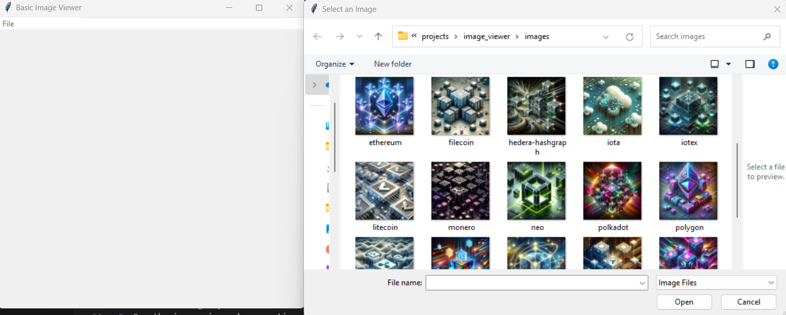

# Basic Image Viewer

Basic Image Viewer is a simple Python application that allows users to open and view images stored on their computer. It provides a straightforward interface for displaying images.

## Features

- Open and view images in various formats (PNG, JPG, JPEG, GIF, BMP).
- User-friendly interface with a menu for file selection.
- Supports navigation between multiple images.

## Project Structure

- `image_viewer/`: The main project directory.
    - `main.py`: The Python script for the image viewer application.
    - `images/`: Directory to store the images you want to view.
    - `README.md`: This documentation file.

## Usage

1. Make sure you have Python and the required libraries installed (tkinter and Pillow).
2. Place the images you want to view in the images/ directory.
3. Run the image viewer by executing main.py.
4. Use the "File" menu to open an image file from the images/ directory.
5. The selected image will be displayed in the viewer window.

## Dependencies

- tkinter: The standard Python interface to the Tk GUI toolkit (included with Python).
- Pillow: The Python Imaging Library (PIL) fork for opening, manipulating, and saving image files.

## Contribution

Contributions to this project are welcome. Feel free to submit issues or pull requests.

## License

This project is open-source and available under the [MIT License](LICENSE).